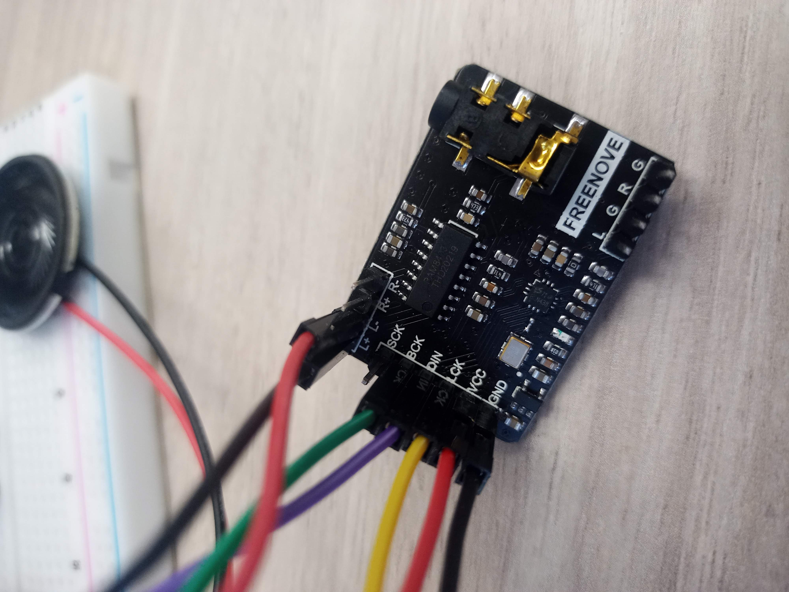

# Exercice 10 - Have a Bluetooth Christmas

Question de se mettre dans l'ambiance des fêtes, nous allons faire jouer une chanson de Noël depuis un cellulaire sur notre ESP32. En résumé nous allons transformer le ESP32 en enceinte Bluetooth.

Cet exercice est inpiré de l'exercice 29.1 du tutoriel de Freenove sur la programmation du ESP32 en C.

- [ ] Créez le montage suivant

{.center .shadow}

L'image n'est pas très claire. Utilisez un module PCM5102A qui permet d'amplifier le son. Sur le module connecter les broches suivantes : 

- BCK -> GPIO 26
- DIN -> GPIO 22
- LCK -> GPIO 25
- VCC -> 5V
- GND -> Mise à la terre
- L+ -> Fil noir du speaker
- L- -> Fil rouge du speaker 

{.center .shadow}

{.center .shadow}

{.center .shadow}

Copiez le code suivant dans un nouveau croquis en ajustant les broches GPIO au besoin.

```c title="script.js" linenums="1"
/**********************************************************************
  Filename    : Bluetooth Music By PCM5102
  Description : Use ESP32 to play the audio received via Bluetooth.
                Use your phone's Bluetooth connection to ESP32, 
                then open the music APP and play the music, 
                and you'll hear ESP32 play the phone's music
  Auther      : www.freenove.com
  Modification: 2021/12/02
**********************************************************************/
#include "BluetoothSerial.h"
#include "driver/i2s.h"
#include "nvs.h"
#include "nvs_flash.h"

#include "esp_bt.h"
#include "bt_app_core.h"
#include "bt_app_av.h"
#include "esp_bt_main.h"
#include "esp_bt_device.h"
#include "esp_gap_bt_api.h"
#include "esp_a2dp_api.h"
#include "esp_avrc_api.h"

#define CONFIG_I2S_LRCK_PIN 25
#define CONFIG_I2S_BCK_PIN  26
#define CONFIG_I2S_DATA_PIN 22
BluetoothSerial SerialBT;

void setup() {
  Serial.begin(9600);
  SerialBT.begin("ESP32");
  Serial.println("Init seccess!");

  esp_err_t err = nvs_flash_init();
  if (err == ESP_ERR_NVS_NO_FREE_PAGES || err == ESP_ERR_NVS_NEW_VERSION_FOUND) {
    ESP_ERROR_CHECK(nvs_flash_erase());
    err = nvs_flash_init();
  }
  
  i2s_config_t i2s_config;
  i2s_config.mode = (i2s_mode_t)(I2S_MODE_MASTER | I2S_MODE_TX);
  
  i2s_config.bits_per_sample = I2S_BITS_PER_SAMPLE_32BIT;
  i2s_config.sample_rate = 44100;
  i2s_config.channel_format = I2S_CHANNEL_FMT_RIGHT_LEFT;
  i2s_config.communication_format = I2S_COMM_FORMAT_STAND_MSB;
  i2s_config.intr_alloc_flags = 0;
  i2s_config.dma_buf_count = 6;
  i2s_config.dma_buf_len = 60;
  i2s_config.tx_desc_auto_clear = true;
  i2s_driver_install(I2S_NUM_0, &i2s_config, 0, NULL);
  
  i2s_pin_config_t pin_config;
  pin_config.bck_io_num = CONFIG_I2S_BCK_PIN;
  pin_config.ws_io_num = CONFIG_I2S_LRCK_PIN;
  pin_config.data_out_num = CONFIG_I2S_DATA_PIN;
  pin_config.data_in_num = -1;
  i2s_set_pin(I2S_NUM_0, &pin_config);

  bt_app_task_start_up();
  
 /* initialize A2DP sink */
  esp_a2d_register_callback(&bt_app_a2d_cb);
  esp_a2d_sink_register_data_callback(bt_app_a2d_data_cb);
  esp_a2d_sink_init();
  /* initialize AVRCP controller */
  esp_avrc_ct_init();
  esp_avrc_ct_register_callback(bt_app_rc_ct_cb);
  /* set discoverable and connectable mode, wait to be connected */
  esp_bt_gap_set_scan_mode(ESP_BT_CONNECTABLE, ESP_BT_GENERAL_DISCOVERABLE);
  Serial.println("ok");
}

void loop(){
  ;  
}
```

Enregistrez le programme et dans le même répertoire que le fichier ino copiez les fichiers inclus dans ce fichier compressé : [ex10_lib.zip](../assets/files/ex10_lib.zip)

Finalement une petite modification dans l'interface de Arduino IDE : 

{.center .shadow}

Ajustez les valeurs suivante : 

- *Flash Frequency: "80Mhz"*
- *Flash Mode: "DOUT"*
- *Partition Scheme: "Huge APP (3MB No OTA/1MD SPIFFS)"*

Maintenant on teste le tout, téléversez le croquis sur le ESP32, ensuite connectez-vous en Bluetooth avec votre cellulaire. (Vous devrez peut-être refaire un "pairage" si vous aviez fait les exercices des notes de cours sur le Bluetooth).

Essayez maintenant de faire jouer une chanson de Noël sur votre cellulaire, le son sera diffusé par le speaker de votre montage. Vous pouvez aussi brancher des écouteurs ou des haut-parleurs externe au module PCM5102A

!!! Danger

    - Il est strictement defendu de faire jouer *All I Want For Christmas Is You* de Mariah Carer sous peine de lourdes conséquences

## Mediagraphie

Les exercices sont extrait et inspiré du tutoriel pour ESP32 en langage C de Freenove :

- www.freenove.com. (n.d.). C_Tutorial.pdf Page 316-322
