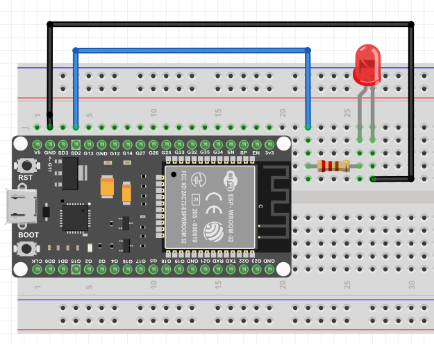

# Connexion Bluetooth

Le ESP32 possède une interface Bluetooth qu'on peut utiliser pour connecter un appareil. Dans une connexion Bluetooth il y a un appareil en mode *Master* qui va peut se connecter à d'autres appareils en mode *slave*. Habituellement le ESP32 sera en mode *slave*.

Pour gérer la connexion nous allons utiliser la librairie `BluetoothSerial.h` qui est déjà installé avec Arduino IDE. L'appareil *Master* sera soit:

- Votre téléphone portable Android qui utilisera l'application [Serial Bluetooth Terminal](https://play.google.com/store/apps/details?id=de.kai_morich.serial_bluetooth_terminal&hl=fr&gl=US){target=_blank}. 
- Votre ordinateur Windows avec l'application [Bluetooth Serial Tool](https://apps.microsoft.com/detail/9nrs6v7h0n9b)

La librairie BluetoothSerial utilise le profil [SPP](https://www.bluetooth.com/specifications/specs/serial-port-profile-1-1/), qui n'est pas supporté par iOS, donc ne peut communiquer avec les iPhones.  L'utilisation de BLE pourrait le permettre. [détails](https://forum.arduino.cc/t/esp32-bluetooth-from-ios/954195/2)

## Premier test de connexion

- [ ] Installez **Serial Bluetooth Terminal** sur votre téléphone portable.
- [ ] Branchez votre ESP32 à votre ordinateur et téléversé le code suivant

```c title="testBluetooth.ino" linenums="1"
#include "BluetoothSerial.h"

BluetoothSerial SerialBT;
// String buffer;

void setup() {
  Serial.begin(9600); // Initialise le port série du ESP32
  SerialBT.begin("ESP32Test"); //Initialise le Bluetooth, le nom donné sera celui de l'appareil
  Serial.println("L'appareil est démarré, vous pouvez maintenant le jumelé par Bluetooth!");
}

void loop() {
  // Écoute s'il y a des données dans le port série du ESP32
  if(Serial.available()) {
    // Les envoies par Bluetooth
    SerialBT.write(Serial.read());
  }
  // Écoute s'il y a des données reçu par Bluetooth
  if(SerialBT.available()) {
    // Les écrits dans la console série du ESP32
    Serial.write(SerialBT.read());
  }
  delay(20);
}
```

- [ ] Maintenant lancé l'application **Serial Bluetooth Terminal** sur votre cellulaire et dans les configurations à l'option *devices* choisissez votre esp32.
- [ ] Testez ensuite la connexion en envoyant au esp32 un message depuis le cellulaire et vice versa


## Controler une DEL

Continuons notre exploration des possibilités que nous offre le Bluetooth en contrôlant une DEL depuis notre cellulaire.

- [ ] Faites le montage suivant :

{.center .shadow}

**Fonctionnement**

Notre programme va permettre d'allumer la DEL en envoyant le texte `del_on` par le port série et de l'éteindre avec `del_off`.

- [ ] Copiez le code suivant dans un nouveau fichier

```c title="bluetoothDel.ino" linenums="1"
#include "BluetoothSerial.h"
#include "string.h"
#define PIN_DEL 2

BluetoothSerial SerialBT;
char buffer[20];
static int position = 0;

void setup() {
  Serial.begin(9600); // Initialise le port série du ESP32
  SerialBT.begin("ESP32Test"); //Initialise le Bluetooth, le nom donné sera celui de l'appareil
  Serial.println("L'appareil est démarré, vous pouvez maintenant le jumelé par Bluetooth!");
  pinMode(PIN_DEL, OUTPUT);

  // Faire clignoter la DEL pour indiquer que tout est prêt
  for (int i = 0; i < 3; i++) {
    digitalWrite(PIN_DEL, HIGH);
    delay(200);
    digitalWrite(PIN_DEL, LOW);
    delay(200);
  }

}

void loop() {
  // Rempli le tableau buffer avec les données reçues
  // Chaque caractère remplira une case du tableau
  while(SerialBT.available()){
    buffer[position] = SerialBT.read();
    position++;
  }

  // Si on a du contenu dans le tableau
  if(position>0){
    Serial.print(buffer); // Imprime le tableau pour vérification

    // Regarde dans le tableau si les 6 premiers caractères correspondent à "del_on"
    if(strncmp(buffer, "del_on", 6)==0){
      // Allume la DEL
      digitalWrite(PIN_DEL, HIGH);
    }
    // Regarde dans le tableau si les 7 premiers caractères correspondent à "del_off"
    if(strncmp(buffer, "del_off", 7)==0){
      // Éteint la DEL
      digitalWrite(PIN_DEL, LOW);
    }

    position=0;
    memset(buffer, 0, 20);  
  }
}
```

On donne à la fonction **strncmp** notre tableau de charactères reçu comme premier paramètre, le texte qu'on veut valider en deuxième et le nombre de caractère du tableau à utiliser. Pour plus d'informations sur la fonction **strncmp** : [https://www.tutorialspoint.com/c_standard_library/c_function_strncmp.htm](https://www.tutorialspoint.com/c_standard_library/c_function_strncmp.htm){target=_blank}

- [ ] Maintenant tester votre programme en envoyant les commandes "del_on" et "del_off" au ESP32 depuis votre cellulaire.

## Mediagraphie

Les exercices sont extrait et inspiré du tutoriel pour ESP32 en langage C de Freenove :

- www.freenove.com. (n.d.). C_Tutorial.pdf Page 285-322
