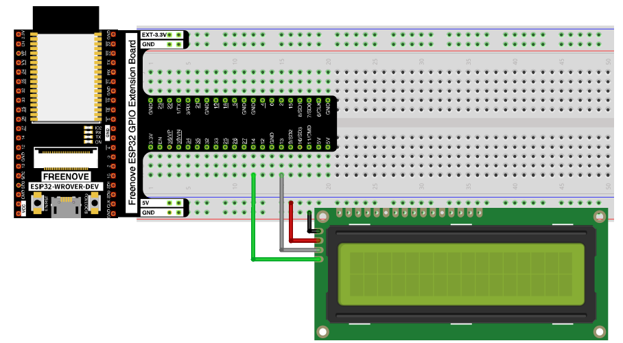
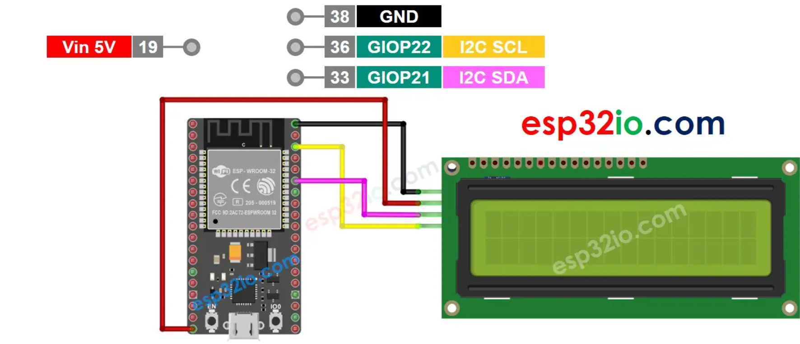
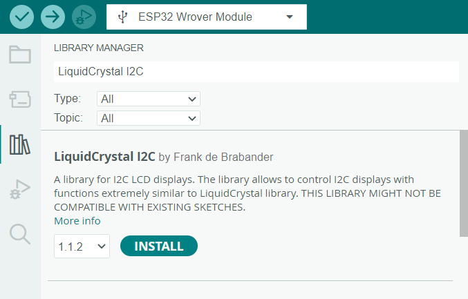

# Écran LCD

L'écran LCD que nous allons utiliser est le I2C LCD1602. Grâce à un module de communication parallèle/série intégré il n'y a que 4 branchements à faire. Référez-vous aux images suivantes pour les branchements : 

{.center .shadow}

{.center .shadow}

*Libre à vous d'utiliser les ports GPIO que vous souhaitez*

> Attention: Arduino définit SDA et SCL dans les Sketch comme 21 et 22, qui sont les broches par défaut pour le I2C.  Si vous voulez utiliser d'autres broches pour votre montage, utilisez vos propres defines (ex. BROCHE_SDA).

> Attention: L'adresse IC2 du module LCD change avec le manufacturier:  votre LCD du kit Freenove peut utiliser 0x3F ou 0x27, même s'il semble identique à celui de votre voisin. Notez l'adresse à utiliser pour votre LCD une fois validé.

## Installation de la librairie 

Dans Arduino IDE installez la librairie `LiquidCrystal I2C`.

{.center .shadow}

## Utilisation

L'extrait de code suivant est tiré d'un tutoriel de la documentation de Freenove. Il vous montre comment afficher un texte sur l'écran.

```c linenums="1"
// Importation des librairies
#include <LiquidCrystal_I2C.h>
#include <Wire.h>

#define BROCHE_SDA 13 //Broche SDA
#define BROCHE_SCL 14 //Broche SCL

// Instanciation de l'écran
LiquidCrystal_I2C lcd(0x3F, 16, 2);
// Si l'écran ne peut afficher le texte changer la ligne pour 
// LiquidCrystal_I2C lcd(0x27, 16, 2);

void setup() {
  Wire.begin(BROCHE_SDA, BROCHE_SCL); // branchement des broches IIC
  lcd.init(); // Initialisation de l'écran
  lcd.backlight(); // Allume la lumière de fond
  lcd.setCursor(0,0); // Positionne le curseur à la colonne 0, ligne 0
  lcd.print("hello, world! ");
}

void loop() {
  lcd.setCursor(0,1); // Positionne le curseur à la colonne 0, ligne 1
  lcd.print("Counter:");
  lcd.print(millis() / 1000);
  delay(1000);
}
```

Pour écrire dans l'écran, on va positionner le curseur à l'endroit désiré avec la commmande `setCursor(Colonne, Ligne)` et ensuite écrire le texte désiré avec `print("mon texte")`.

- `setCursor(Colonne, Ligne)` : Positionne le curseur à la colonne et la ligne spécifiées
- `print("texte")` : Affiche le texte à partir de la position du curseur
- `clear()` : Efface tout l'écran


## Sources

- Freenove. (n.d.). Freenove/freenove_ultimate_starter_kit_for_esp32: Apply to FNK0047. [https://github.com/Freenove/Freenove_Ultimate_Starter_Kit_for_ESP32](https://github.com/Freenove/Freenove_Ultimate_Starter_Kit_for_ESP32) 
- ESP32 - LCD. ESP32 Tutorial. (n.d.). [https://esp32io.com/tutorials/esp32-lcd](https://esp32io.com/tutorials/esp32-lcd) 
