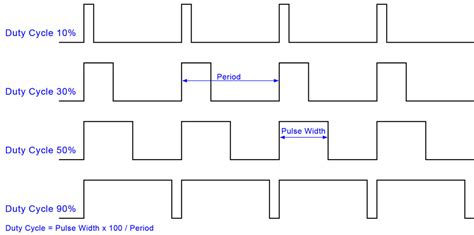
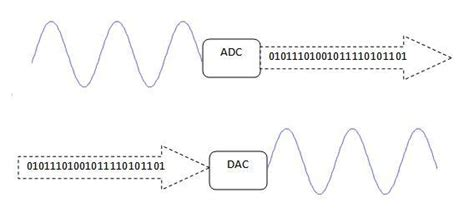

# Arduino : Concepts avancés

Cette semaine, nous allons approfondir certains concepts clés pour mieux maîtriser l'Arduino.

---

## 1. Rappel des commandes de base

Avant de plonger dans de nouveaux sujets, voici un bref rappel des fonctions que nous avons vues la semaine dernière :

- **Communication série** :
  - `Serial.begin(9600)` : Initialise la communication série à 9600 bauds.
  - `Serial.print("Hello")` : Affiche du texte sans saut de ligne.
  - `Serial.println("World")` : Affiche du texte avec un saut de ligne.

- **Entrées/sorties numériques** :
  - `pinMode(pin, OUTPUT)` : Configure une broche en mode sortie.
  - `pinMode(pin, INPUT)` : Configure une broche en mode entrée.
  - `digitalWrite(pin, HIGH)` : Envoie un signal haut (5V) sur une broche.
  - `digitalRead(pin)` : Lit l'état d'une broche numérique (HIGH ou LOW).

- **Entrées/sorties analogiques** :
  - `analogRead(pin)` : Lit une valeur analogique (de 0 à 1023).
  - `analogWrite(pin, value)` : Envoie un signal PWM (simulant une sortie analogique).

---

## 2. PWM (Pulse-Width Modulation)

La **modulation de largeur d'impulsion (PWM)** est une technique utilisée pour simuler une sortie analogique à l'aide d'un signal numérique. Au lieu d'une tension constante, le PWM envoie des impulsions carrées à une fréquence fixe.

{.center .shadow}

- **Duty Cycle (Rapport cyclique)** : C'est le pourcentage de temps pendant lequel le signal est à l'état HAUT.
  - 0% : Le signal est toujours BAS (0V).
  - 50% : Le signal est HAUT la moitié du temps (environ 2.5V de moyenne).
  - 100% : Le signal est toujours HAUT (5V).

- **`analogWrite(pin, value)`** :
  - `pin` : Doit être une broche PWM (marquée d'un tilde `~` sur la plupart des cartes Arduino, comme les broches 3, 5, 6, 9, 10, 11 sur une UNO).
  - `value` : Un entier de **0** (0% de rapport cyclique) à **255** (100% de rapport cyclique).

**Exemple : Faire varier l'intensité d'une LED**
```cpp
const int ledPin = 9; // Broche PWM

void setup() {
  pinMode(ledPin, OUTPUT);
}

void loop() {
  for (int i = 0; i <= 255; i++) {
    analogWrite(ledPin, i);
    delay(10);
  }
  for (int i = 255; i >= 0; i--) {
    analogWrite(ledPin, i);
    delay(10);
  }
}
```

---

## 3. ADC et DAC : Le monde analogique et numérique

{.center .shadow}

### ADC (Analog-to-Digital Converter)
L'**ADC** convertit une tension analogique (comme celle d'un potentiomètre) en une valeur numérique que le microcontrôleur peut lire.

- **Résolution** : La précision de la conversion.
  - **10 bits (Arduino UNO)** : La tension (0-5V) est divisée en **1024** niveaux (2^10). La fonction `analogRead()` retourne donc une valeur entre **0 et 1023**.
  - **8 bits** : La tension serait divisée en **256** niveaux (2^8), offrant une précision moindre.

Un ADC 10 bits est donc plus précis qu'un ADC 8 bits car il peut détecter de plus petites variations de tension.

### DAC (Digital-to-Analog Converter)
Le **DAC** fait l'inverse : il convertit une valeur numérique en une tension analogique réelle. La plupart des cartes Arduino (comme la UNO) n'ont **pas de vrai DAC**. Elles simulent une sortie analogique avec le **PWM**.

Certaines cartes, comme l'Arduino Due ou l'ESP32, possèdent de vrais DAC.

---

## 4. La fonction `map()`

La fonction `map()` est un outil très pratique pour mettre à l'échelle une valeur d'une plage à une autre.

**Syntaxe** :
```cpp
map(valeur, minOrigine, maxOrigine, minDest, maxDest);
```
- `valeur` : Le nombre à convertir.
- `minOrigine`, `maxOrigine` : La plage d'origine de la valeur.
- `minDest`, `maxDest` : La plage de destination souhaitée.

**Exemple : Contrôler la luminosité d'une LED avec un potentiomètre**

Le potentiomètre nous donne une valeur de 0 à 1023 (`analogRead`), mais la LED a besoin d'une valeur de 0 à 255 (`analogWrite`).

```cpp
const int potPin = A0;
const int ledPin = 9;

void setup() {
  pinMode(ledPin, OUTPUT);
}

void loop() {
  // Lire la valeur du potentiomètre (0-1023)
  int potValue = analogRead(potPin);

  // Mettre à l'échelle cette valeur pour le PWM (0-255)
  int ledValue = map(potValue, 0, 1023, 0, 255);

  // Appliquer la valeur à la LED
  analogWrite(ledPin, ledValue);
}
```

Cet exemple est beaucoup plus simple et lisible que de faire le calcul manuellement (`ledValue = potValue / 4;`).
