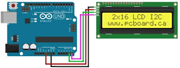
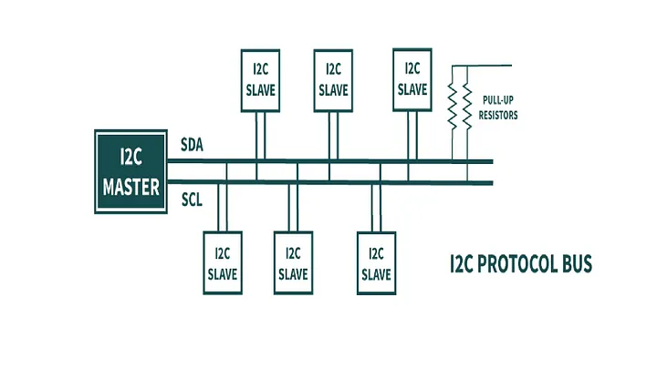
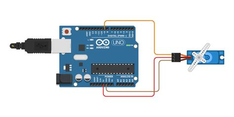
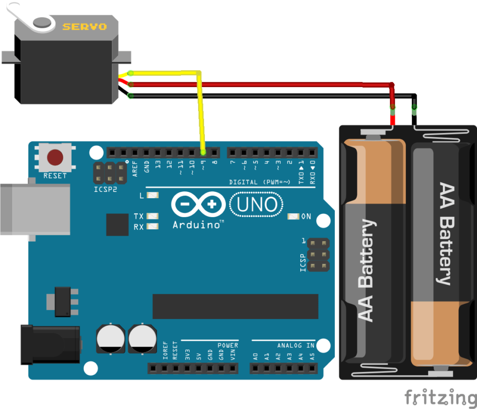
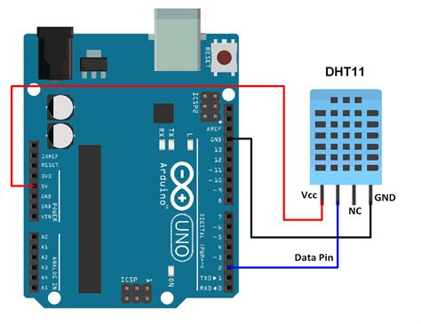

# Arduino : I2C, Servomoteur et Capteur DHT11

Cette semaine, nous allons explorer des composants couramment utilisés avec l'Arduino : l'écran LCD via un module I2C, les servomoteurs et le capteur de température/humidité DHT11.

---

## 1. L'écran LCD et le module I2C

Un écran LCD (Liquid Crystal Display) est un composant essentiel pour afficher des informations de manière lisible. Les écrans LCD 16x02 (16 caractères sur 2 lignes) sont très populaires. Pour simplifier leur câblage, on utilise souvent un module I2C.

{.center .shadow}

{.center .shadow}

### Qu'est-ce que l'I2C ? (Inter-Integrated Circuit)

L'**I2C** est un protocole de communication série qui permet à plusieurs "maîtres" (comme l'Arduino) de communiquer avec plusieurs "esclaves" (comme le module I2C de l'écran LCD) en utilisant seulement deux fils :
- **SDA (Serial Data Line)** : Pour l'envoi et la réception des données.
- **SCL (Serial Clock Line)** : Pour la synchronisation des données.

**Avantages de l'I2C :**
- **Simplicité de câblage** : Réduit le nombre de broches nécessaires sur l'Arduino (seulement 2 broches, plus l'alimentation).
- **Multiples périphériques** : Plusieurs composants I2C peuvent être connectés sur les mêmes deux fils, chacun ayant une adresse unique.

### Utilisation avec l'écran LCD

Le module I2C pour LCD (souvent un PCF8574) est un petit circuit imprimé qui se soude directement à l'arrière de l'écran LCD. Il se connecte à l'Arduino avec 4 fils :
- VCC (Alimentation 5V)
- GND (Masse)
- SDA (Broche SDA de l'Arduino - A4 sur UNO, 21 sur ESP32)
- SCL (Broche SCL de l'Arduino - A5 sur UNO, 22 sur ESP32)

**Librairies nécessaires :**
Pour utiliser un écran LCD avec un module I2C, la librairie `LiquidCrystal_I2C` est couramment utilisée. Elle nécessite souvent la librairie `Wire` pour la communication I2C.

**Exemple de code (Arduino UNO) :**
```cpp
#include <Wire.h> 
#include <LiquidCrystal_I2C.h>

// Définir l'adresse I2C de l'écran LCD
// Les adresses communes sont 0x27 ou 0x3F, cela peut varier selon le fabricant.
LiquidCrystal_I2C lcd(0x27, 16, 2);  // Adresse, colonnes, lignes

void setup() {
  lcd.init();      // Initialise l'écran LCD
  lcd.backlight(); // Allume le rétroéclairage
  lcd.print("Hello, World!"); // Affiche le texte sur l'écran
}

void loop() {
  // Rien à faire ici pour cet exemple simple
}
```

---

## 2. Le Servomoteur

Un **servomoteur** est un type de moteur qui permet un contrôle précis de sa position angulaire. Contrairement aux moteurs DC qui tournent en continu, un servomoteur tourne vers une position spécifique et la maintient. Ils sont très utilisés en robotique, pour les modélismes et dans les systèmes automatisés.

{.center .shadow}

### Alimentation des servomoteurs (Source externe)

Les servomoteurs, surtout les plus gros, peuvent consommer un courant significatif. L'alimentation directe depuis l'Arduino est souvent insuffisante et peut endommager la carte ou provoquer des comportements instables. Il est fortement recommandé d'utiliser une source d'alimentation externe.

!!! warning "Masse Commune (Ground Commun)"
    Lorsque vous utilisez une alimentation externe pour le servomoteur, il est **impératif** de connecter la **masse (GND) de l'Arduino** avec la **masse (GND) de votre alimentation externe**. Sans cette masse commune, le servomoteur ne recevra pas de signal de référence correct et ne fonctionnera pas.

{.center .shadow}

### Comment ça marche ?

Les servomoteurs sont contrôlés par un signal **PWM (Pulse-Width Modulation)**. C'est crucial de noter que sans un signal PWM approprié, le servomoteur ne fonctionnera pas correctement. L'angle de rotation est déterminé par la durée (largeur) de l'impulsion envoyée sur le fil de données.
- Une impulsion d'environ 1 ms (milliseconde) peut faire tourner le servo à 0 degrés.
- Une impulsion d'environ 1.5 ms peut le faire tourner à 90 degrés (position centrale).
- Une impulsion d'environ 2 ms peut le faire tourner à 180 degrés.

**Connexion :**
Un servomoteur a généralement trois fils :
- **Marron/Noir** : Masse (GND)
- **Rouge** : Alimentation (VCC, souvent 5V)
- **Orange/Jaune** : Signal (connecté à une broche PWM de l'Arduino)

**Librairie nécessaire :**
La librairie `Servo.h` est intégrée à l'IDE Arduino et simplifie grandement le contrôle des servomoteurs.

**Exemple de code (Arduino UNO) :**
```cpp
#include <Servo.h>

Servo monServo;  // Crée un objet servo

void setup() {
  monServo.attach(9); // Attache le servo à la broche 9 (broche PWM)
}

void loop() {
  monServo.write(0);   // Met le servo à 0 degrés
  delay(1000);         // Attend 1 seconde
  monServo.write(90);  // Met le servo à 90 degrés
  delay(1000);
  monServo.write(180); // Met le servo à 180 degrés
  delay(1000);
}
```

---

## 3. Le Capteur de Température et d'Humidité DHT11

Le **DHT11** est un capteur numérique bas coût très populaire pour mesurer la température et l'humidité de l'air. Il est facile à utiliser et offre une précision suffisante pour de nombreux projets.

{.center .shadow}

### Caractéristiques :
- **Plage de mesure d'humidité** : 20-95% RH (avec une précision de ±5%)
- **Plage de mesure de température** : 0-50°C (avec une précision de ±2°C)
- **Taux d'échantillonnage** : 1 Hz (une lecture par seconde)

### Connexion :
Le DHT11 a 3 ou 4 broches, selon le module :
- **VCC (+)** : Alimentation (3.3V ou 5V)
- **GND (-)** : Masse
- **Data (S)** : Broche de données (nécessite une résistance de pull-up de 10kΩ si elle n'est pas intégrée au module)

La broche de données est connectée à une broche numérique de l'Arduino.

### Librairie nécessaire :
Pour faciliter l'utilisation du DHT11, la librairie `DHT sensor library` d'Adafruit est fortement recommandée. Elle gère la communication complexe avec le capteur.

**Exemple de code (Arduino UNO) :**
```cpp
#include "DHT.h"

#define DHTPIN 2    // Broche numérique à laquelle le DHT11 est connecté
#define DHTTYPE DHT11 // Type de capteur : DHT11

DHT dht(DHTPIN, DHTTYPE); // Initialise le capteur DHT

void setup() {
  Serial.begin(9600);
  Serial.println("DHT11 Test!");

  dht.begin(); // Démarre le capteur DHT
}

void loop() {
  // Attendre quelques secondes entre les mesures.
  delay(2000);

  // Lire l'humidité.
  float h = dht.readHumidity();
  // Lire la température en Celsius.
  float t = dht.readTemperature();

  // Vérifier si la lecture a échoué, sinon afficher les valeurs.
  if (isnan(h) || isnan(t)) {
    Serial.println("Failed to read from DHT sensor!");
  } else {
    Serial.print("Humidity: ");
    Serial.print(h);
    Serial.print(" %	");
    Serial.print("Temperature: ");
    Serial.print(t);
    Serial.println(" *C");
  }
}
```
